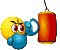

# Punching Bag



A Crystal shard for tracking and analyzing hit counts, trending items, time and location analytics for PostgreSQL.

[](https://github.com/dcalixto/punching_bag/actions/workflows/crystal-test.yml)

## Features

- Timezone-aware tracking using PostgreSQL's TIMESTAMPTZ
- Location-based analytics support
- Configurable hit counting
- Time-based popularity tracking
- Efficient indexing for fast queries
- Lightweight and fast

## Requirements

- Crystal >= 1.0.0

## Installation

1. Add Punching Bag to your `shard.yml`:

```yaml
dependencies:
  punching_bag:
    github: dcalixto/punching_bag
```

2. Install dependencies:

```crystal
shards install
```

3. Run the setup command:

```crystal
crystal run bin/punching_bag.cr -- setup
```

If the setup has already been completed, you will see the following message in your terminal:

```crystal
Setup already completed.
```

## Usage

Import the library

```crystal
require "punching_bag"
```

**_Then in your application code, you can set it up like:_**

Initialize database connection

```crystal
PunchingBag.configure do |config|
  config.database_url = "postgres://localhost/your_database"
end
```

## Initialize the tracker

```crystal
# Initialize tracker
tracker = PunchingBag::Tracker.new(PunchingBag.db)
```

Record a hit

```crystal
tracker.punch("Article", 1)
```

Track hits with custom timestamp and timezone

```crystal
timestamp = Time.local(timezone: Time::Location.load("America/New_York"))
tracker.punch("Article", 1, hits: 1, timestamp: timestamp)
```

Record multiple hits

```crystal
tracker.punch("Article", 1, hits: 5)
```

Record hit with timestamp

```crystal
tracker.punch("Article", 1, timestamp: Time.utc - 1.day)
```

## Analytics

Get total hits for an item

```crystal
total = tracker.total_hits("Article", 1)
```

Get most hit items since last week

```crystal
trending = tracker.most_hit(Time.utc - 1.week)
```

Get top 10 most hit items since last month

```crystal
top_items = tracker.most_hit(Time.utc - 1.month, limit: 10)
```

Get average time for hits

```crystal
avg_time = tracker.average_time("Article", 1)
```

Clear all recorded hits

```crystal
tracker.clear
```

## Example Integration

Here’s an example of integrating Punching Bag into an application.

```crystal
require "punching_bag"
require "db/serializable"

class Article
 include DB::Serializable

   property id : Int64
   property title : String

  def self.db=(database : DB::Database)
    @@db = database
  end

  def self.db
    @@db.not_nil!
  end

  def track_view
    tracker = PunchingBag.new(@@db.not_nil!)
    tracker.punch("Article", id.not_nil!)
  end

  def total_views
    tracker = PunchingBag.new(@@db.not_nil!)
    tracker.total_hits("Article", id.not_nil!)
  end

  def self.trending(since = Time.utc - 1.week, limit = 10)
    tracker = PunchingBag.new(@@db.not_nil!)
    tracker.most_hit(since, limit: limit)
  end
end

```

The Routes

```crystal
get "/articles/:id" do |env|
  if article = Article.find(env.params.url["id"].to_i64)
    article.track_view
    render "article/show.ecr"
  else
    env.redirect "/articles"
  end
end
```

View

To display the total view count in your view, use the following HTML:

```crystal
<div class="views-count">
  Views: <%= article.total_views %>
</div>
```

## Development

```crystal
crystal spec
```

## Contributing

1. Fork it (https://github.com/dcalixto/punching_bag/fork)
2. Create your feature branch (`git checkout -b my-feature`)
3. Commit your changes (`git commit -am 'Add feature'`)
4. Push to the branch (`git push origin my-feature`)
5. Create a new Pull Request

## Contributors

Daniel Calixto - creator and maintainer

## License

MIT License. See LICENSE for details.
